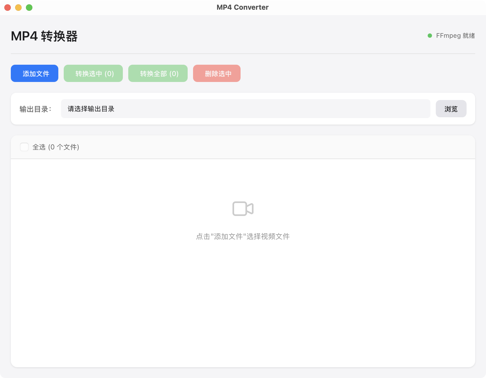
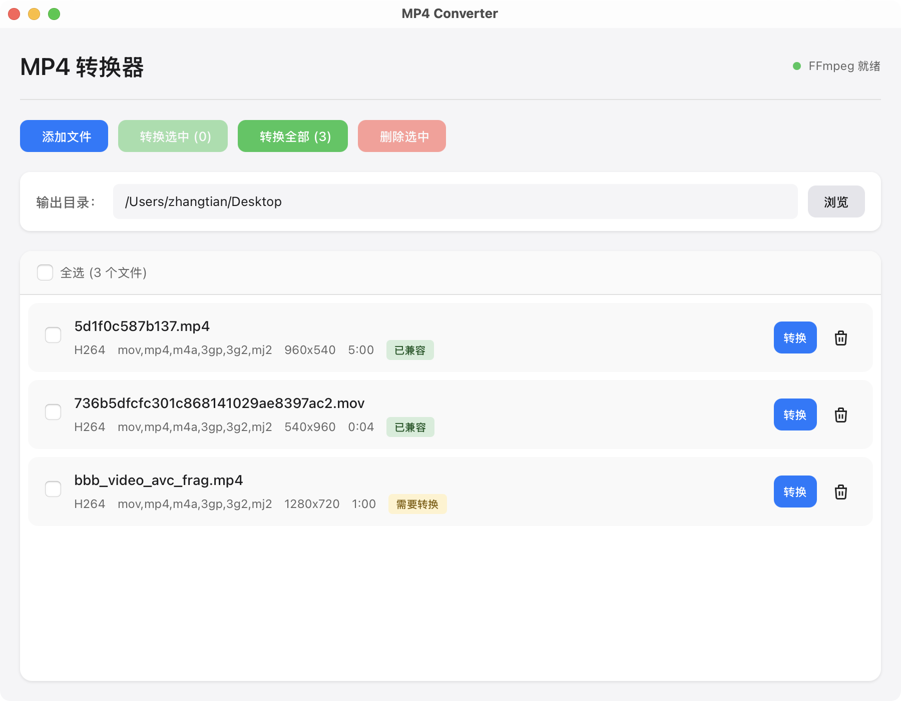
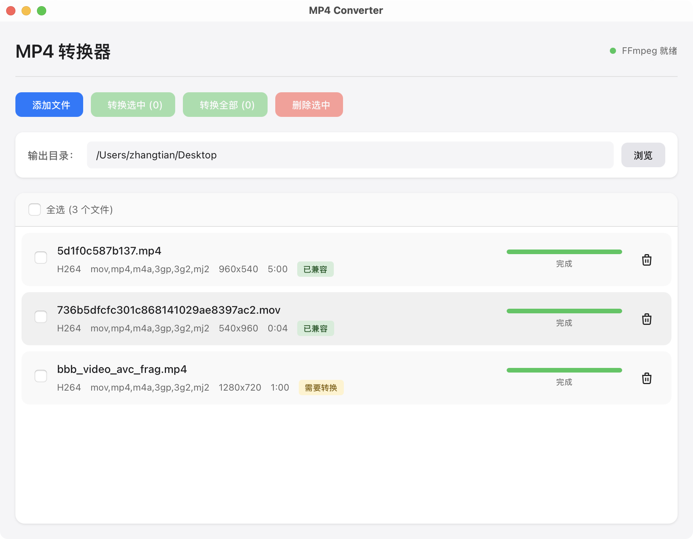

# MP4 Converter

一个简洁高效的视频转换桌面应用，将各种格式的视频转换为移动设备兼容的 MP4 格式（H.264 + AAC）。


## 功能特性

- **批量转换** - 支持同时添加多个视频文件，批量转换
- **智能编码** - 自动检测视频编码，已是 H.264/AAC 的流直接复制，无需重新编码
- **实时进度** - 显示每个文件的转换进度
- **硬件加速** - macOS 使用 VideoToolbox 硬件编码，速度更快
- **多线程** - 自动利用多核 CPU 加速转换
- **移动端兼容** - 输出文件支持 faststart，适合移动设备和网络播放

## 支持的输入格式

MP4, MOV, AVI, MKV, WMV, FLV, WebM, M4V, MPEG, MPG, 3GP

## 截图





## 安装

### 从 Release 下载

前往 [Releases](../../releases) 页面下载对应平台的安装包：

- **macOS**: `.dmg` 文件
- **Windows**: `.msi` 或 `.exe` 安装程序
- **Linux**: `.deb` 或 `.AppImage`

### 从源码构建

#### 前置条件

- [Node.js](https://nodejs.org/) >= 18
- [Rust](https://www.rust-lang.org/tools/install) >= 1.70
- [pnpm](https://pnpm.io/)（推荐）或 npm

#### 构建步骤

```bash
# 克隆仓库
git clone https://github.com/zt123123/mp4-converter.git
cd mp4-converter

# 安装依赖
npm install

# 开发模式运行
npm run tauri

# 构建生产版本
npm run tauri:build
```

构建产物位于 `src-tauri/target/release/bundle/` 目录。

## 使用方法

1. **添加文件** - 点击「添加文件」按钮选择要转换的视频
2. **选择输出目录** - 点击「浏览」选择转换后文件的保存位置
3. **开始转换** - 点击「转换全部」或选中特定文件后点击「转换选中」

应用会自动检测视频编码，如果已经是兼容格式会显示「已兼容」标签。

## 技术栈

- **前端**: React 18 + TypeScript + Vite
- **后端**: Rust + Tauri 2
- **视频处理**: FFmpeg

## 项目结构

```
mp4-converter/
├── src/                    # React 前端代码
│   ├── App.tsx            # 主应用组件
│   ├── index.css          # 样式文件
│   └── main.tsx           # 入口文件
├── src-tauri/             # Tauri/Rust 后端代码
│   ├── src/
│   │   ├── main.rs        # 应用入口和命令定义
│   │   └── converter.rs   # 视频转换核心逻辑
│   ├── Cargo.toml         # Rust 依赖配置
│   └── tauri.conf.json    # Tauri 配置
├── scripts/
│   └── download-ffmpeg.cjs # FFmpeg 下载脚本
└── package.json
```

## 开发

```bash
# 启动开发服务器
npm run tauri

# 仅启动前端开发服务器
npm run dev

# 代码检查
npm run lint

# 构建前端
npm run build
```

## 贡献

欢迎提交 Issue 和 Pull Request！

1. Fork 本仓库
2. 创建特性分支 (`git checkout -b feature/amazing-feature`)
3. 提交更改 (`git commit -m 'Add some amazing feature'`)
4. 推送到分支 (`git push origin feature/amazing-feature`)
5. 创建 Pull Request

## 许可证

本项目采用 MIT 许可证 - 详见 [LICENSE](LICENSE) 文件。

## 致谢

- [Tauri](https://tauri.app/) - 跨平台桌面应用框架
- [FFmpeg](https://ffmpeg.org/) - 强大的视频处理工具
- [React](https://react.dev/) - 用户界面库
